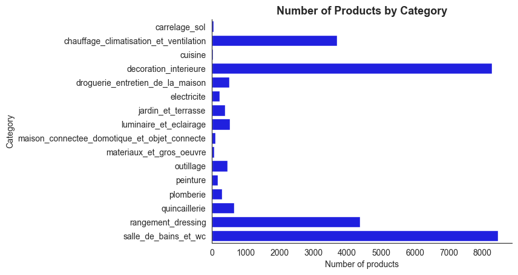
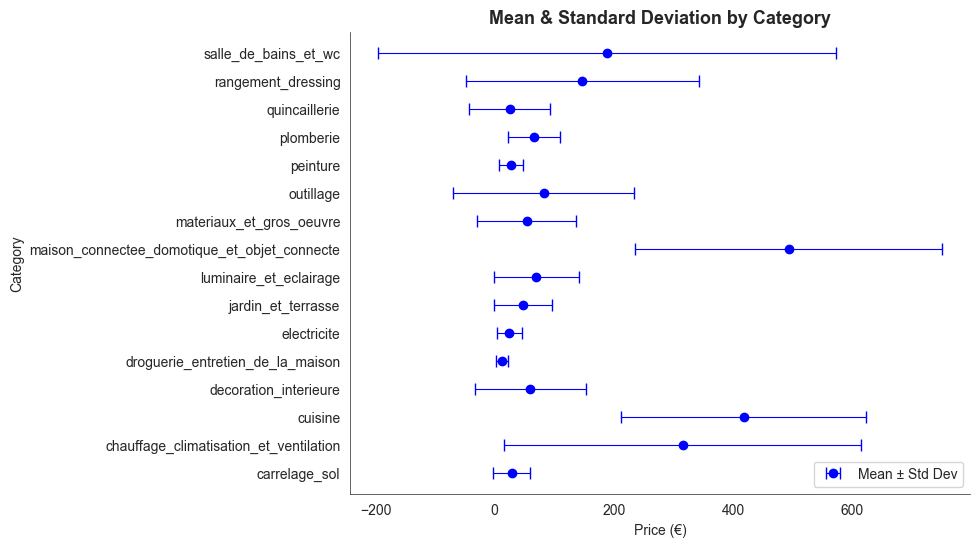
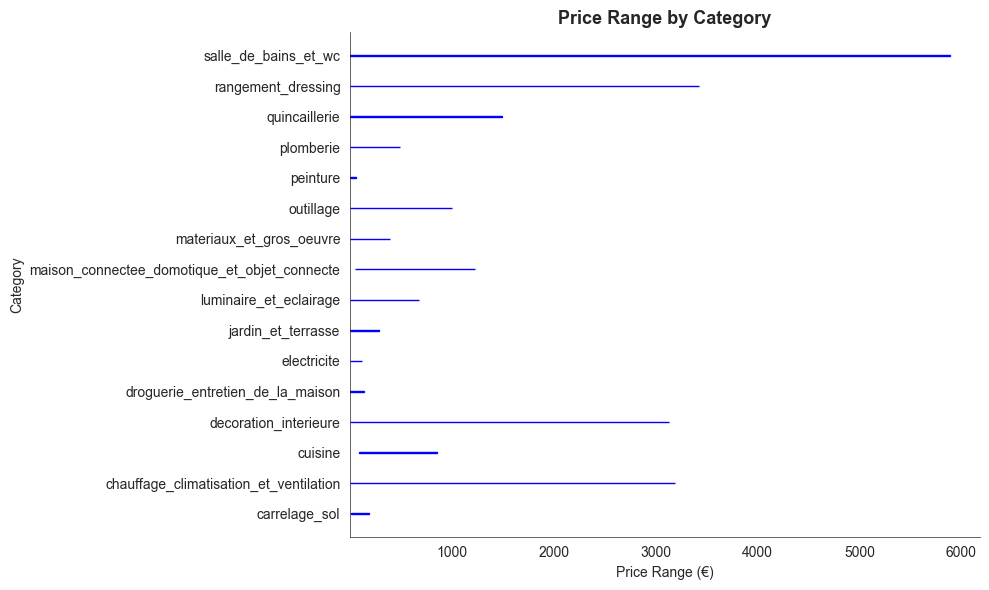
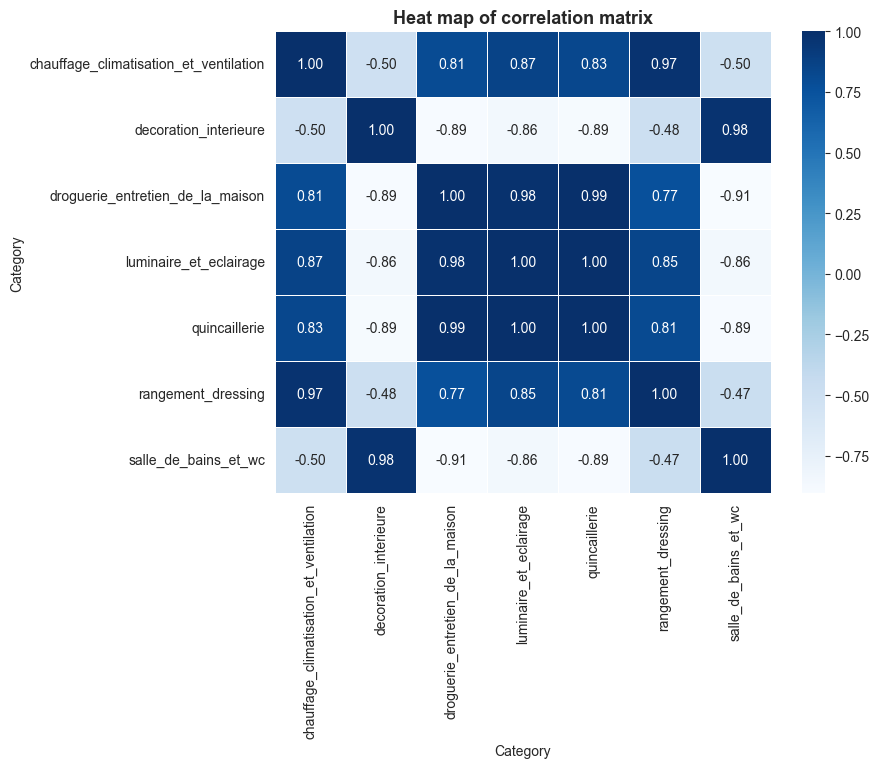

# **Projet de Nettoyage et d'Analyse des Données avec Pandas**


## Aperçu du Projet

Ce projet analyse des données extraites d'un site e-commerce (Castorama ; pour des raisons de propriété intellectuelle, les données ne peuvent pas être partagées). Les données extraites se composent de deux fichiers CSV :

- `categories.csv`: Contient des informations sur les catégories de produits, le statut de la liste des pages et les URLs.

- `products.csv`: Contient des détails sur les produits tels que l'identifiant unique, les catégories, les sous-catégories, les titres, les prix et les URLs.


## Objectifs  

- **Charger les données** issues du scraping (les fichiers CSV categories.csv et products.csv). 
- **Nettoyer et préparer** ces données (corriger les formats, gérer les valeurs manquantes, gérer les types de données). 
- **Explorer les données** et extraire des informations clés (statistiques descriptives, groupby, statistiques, etc.).
- **Mettre en forme les variables (si nécessaire)**  pour faciliter l'analyse (étiquettes de catégories, correction des prix, etc.).
- **Analyser les prix** de manière plus approfondie en regroupant les produits par catégories et en calculant des statistiques (moyenne, min, max, etc.). 
- **Visualiser les résultats** de votre analyse à l'aide de graphiques simples (histogramme, scatter plot, bar plot, etc.) pour mieux communiquer vos conclusions.

## Structure du Projet

* `assets`: Contient les figures de visualisation des données.

* `brief_pandas.ipynb`: Fichier pour exécuter les procédures de nettoyage des données, d'exploration des données, d'analyse des données et de visualisation des données. 

* `requirements.txt`: Liste des dépendances Python nécessaires.

## Installation des dépendances
```bash
pip install -r requirements.txt
```

## Techniques et Outils Clés de Traitement

1. **Exploration et Validation Initiale des Données**

   - Charger les données.
   - Voir la forme des données, l'en-tête, les statistiques résumées, les informations, le bas.
   - Vérifier les valeurs manquantes.
   - Vérifier les doublons.
   - Examiner les données pour des erreurs de format texte ou numérique inhabituelles.

2. **Nettoyage des Données**

   - Normaliser les textes.
   - Supprimer les doublons de texte.
   - Gérer les problèmes d'encodage.
   - Gérer les problèmes de NAs vs NaNs.
   - Gérer les erreurs.
   - Supprimer les doublons diacritiques.
   - Nettoyer les textes des catégories et des produits.

3. **Transformation des Données**

   - Supprimer les accents.
   - Standardiser les formats de texte.
   - Mettre en forme les types de données des variables.

4. **Exploration des Données**

   - Extraire des informations en regroupant, filtrant et explorant les caractéristiques catégorielles et numériques.
   - Préparer les données pour l'analyse.

5. **Visualisation**

   - Utilisation de bibliothèques Python telles que Matplotlib et Seaborn pour la représentation graphique des informations.
   - **Analyse de Corrélation** : Utilisation de méthodes statistiques pour identifier les relations entre les catégories de produits et leurs prix.


## Résumé des Résultats

Dans ce projet, j'ai appliqué des techniques de nettoyage et d'exploration des données sur un ensemble de données extrait d'un site e-commerce (Castorama). Ensuite, une analyse des données a été réalisée pour découvrir des motifs et des informations dans l'ensemble de données. Les principales observations sont rapportées ci-dessous :

### **Aperçu de l'Ensemble de Données**

- L'ensemble de données des catégories comprend **1372 catégories**, chacune décrite par des attributs tels que ::

  - `category`: La catégorie de la page. Notez que "category" dans ce contexte inclut à la fois les catégories parent et enfant.

  - `is_page_list`:(bool) Indique si le lien de la catégorie est un lien de liste de pages. Un lien `page_list` vrai est un lien qui vous mène directement à l'endroit où tous les produits de cette catégorie sont affichés.

  - `url`: Le lien vers la page de cette catégorie.

- L'ensemble de données des produits comprend **28 308 produits**, chacun décrit par des attributs tels que:
  - `unique_id`: Un identifiant unique pour chaque produit.
  - `category`: Catégorie parente du produit.
  - `subcategory`: Premier niveau enfant du produit.
  - `subsubcategory`: Deuxième niveau enfant du produit.
  - `subsubsubcategory`: Troisième niveau enfant du produit.
  - `title`: Nom du produit.
  - `price`: Prix du produit.
  - `url`: Lien vers la page du produit.

- Les produits appartiennent à **16 catégories distinctes**, **52 sous-catégories**, **150 sous-sous-catégories** et **75 sous-sous-sous-catégories**.

### **Répartition des Produits**



- La catégorie **"cuisine"** a le **moindre nombre de produits (30)**, tandis que **"salle_de_bains_et_wc"** a le **plus grand nombre de produits (8 450)**.

- Ces chiffres mettent en évidence la diversité des produits proposés dans les différentes catégories.

### **Analyse des Prix**

- **Prix moyen global**: €145  
  - Prix minimum: €0.50  
  - Prix maximum: €5,890

- Catégories avec des caractéristiques de prix remarquables:



  - **Prix moyen le plus bas**: €12 dans **"droguerie_entretien_de_la_maison"**. 

  - **Prix moyen le plus élevé **: €493** dans **"maison_connectee_domotique_et_objet_connecte"**.  
  

  - **Categorie avec la plage de prix plus petite**: **"peinture"**.  
  - **Categorie avec la plage de prix plus large**: **"salle_de_bains_et_wc"**.

  - Certains des **produits les moins chers** incluent : support en acier estampé (0,50 €), pompe manuelle de remplissage pour tous les fluides (2,60 €) et remplacements de tête de balai en coton (1,60 €).

  - Certains des **produits les plus chers** incluent : baignoire à remous acrylique double (5 890 €), poêle à granulés (3 190 €) et armoire de stockage pour bouteilles de caves ou magasins de vin (3 425 €).


### **Corrélations de Prix Entre Catégories (avec > 500 produits)**



- Des corrélations fortes ont été identifiées entre les prix de certaines catégories. Par exemple :
  - Lorsque les prix dans **"salle_de_bains_et_wc"** augmentent, les prix dans **"decoration_interieure"** tendent également à augmenter.
  - À l'inverse, les prix dans **"quincaillerie"** ont tendance à diminuer lorsque les prix dans **"salle_de_bains_et_wc"** augmentent.
- De telles corrélations peuvent indiquer des tendances de marché partagées, des stratégies de prix ou des relations complémentaires entre produits.


## **Conclusion**

Ce projet a permis d’obtenir des informations précieuses sur la répartition des produits et les tendances de prix dans les différentes catégories du catalogue de Castorama. En comprenant ces schémas, les entreprises peuvent mieux adapter leurs stratégies de prix et leur gestion des stocks pour répondre aux demandes des consommateurs et aux dynamiques du marché.


## **Travaux Futurs**:

- Élargir l’ensemble de données en collectant des attributs supplémentaires tels que les avis clients, la disponibilité des stocks ou les offres promotionnelles.
- Mettre en œuvre des modèles prédictifs pour anticiper la demande des produits ou les fluctuations de prix.
- Réaliser des analyses approfondies sur les tendances au niveau des sous-catégories pour obtenir des renseignements exploitables pour l’entreprise.

## Auteur

- Michael Adebayo ([@MichAdebayo](https://github.com/MichAdebayo))